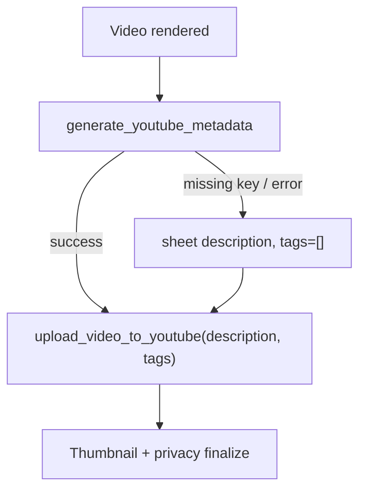

# Gemini YouTube metadata in upload pipeline

## Goal

Before each YouTube upload, call Gemini with `monk_name` + `dhamma_title` to produce localized Burmese metadata, then pass it into `snippet.description` and `snippet.tags`. If Gemini is unavailable, keep current behavior (sheet `description`, no tags).



## 1. Configuration and dependency

**[`requirements-video-automation.txt`](requirements-video-automation.txt)**

- Add `google-genai>=1.28.0`

**[`video_bot/config.py`](video_bot/config.py)**

- `GEMINI_API_KEY = os.getenv("GEMINI_API_KEY", "").strip()` (optional)
- `GEMINI_MODEL = os.getenv("GEMINI_MODEL", "gemini-2.0-flash").strip()`

**Env templates** — add to [`.env.example`](.env.example) and [`deploy/.env.production.example`](deploy/.env.production.example):

```env
GEMINI_API_KEY=
GEMINI_MODEL=gemini-2.0-flash
```

**[`deploy/deploy.secrets.env.example`](deploy/deploy.secrets.env.example)** — document `GEMINI_API_KEY` if that file lists optional secrets.

## 2. New module: Gemini metadata generator

**New file:** [`video_bot/gemini_youtube_metadata.py`](video_bot/gemini_youtube_metadata.py)

**Dataclass / Pydantic result shape:**

```python
@dataclass
class YouTubeMetadata:
    description: str
    tags: list[str]
```

**Prompt design** (system + user):

- Inputs: `monk_name`, `dhamma_title`, channel brand **မုဒြာ Dhamma Channel**
- Output JSON schema (structured response via `google-genai`):
  - `intro` — warm Burmese Dhamma greeting + exactly 3 summary sentences about the sermon topic
  - `copyright_disclaimer` — standard credits for monk/audio source + visual production disclaimer
  - `keywords` — string of 10–15 comma-separated SEO tags (English/Burmese mix OK)
  - `hashtags` — array of 3–5 hashtags (e.g. `#တရားတော်`, `#MonkName`, `#MudraDhamma`)

**Assembly:**

```text
{intro}

{copyright_disclaimer}

{' '.join(hashtags)}
```

**Tags parsing:** split `keywords` on commas, strip whitespace, dedupe case-insensitively, drop empty, enforce YouTube limits (max ~30 tags, each tag ≤ 30 chars, total tag char budget ≤ 500).

**Public API:**

```python
def generate_youtube_metadata(*, monk_name: str, dhamma_title: str) -> YouTubeMetadata | None
```

- Returns `None` when `GEMINI_API_KEY` is unset
- On API/parse errors: log warning, return `None` (caller handles fallback)
- Use `genai.Client(api_key=GEMINI_API_KEY)` and JSON response mode for reliable parsing

## 3. YouTube upload API update

**[`video_bot/youtube.py`](video_bot/youtube.py)** — extend `upload_video_to_youtube`:

```python
def upload_video_to_youtube(..., description: str, tags: list[str] | None = None, ...) -> str:
    snippet = {"title": title[:100], "description": description, "categoryId": "27"}
    if tags:
        snippet["tags"] = tags[:30]  # after sanitization
```

YouTube `videos().insert` already uses `part="snippet,status"` — tags belong in `snippet.tags`.

## 4. Pipeline integration

**[`video_bot/jobs/pipeline.py`](video_bot/jobs/pipeline.py)** — after render/thumbnail prep, **before** `upload_video_to_youtube`:

```python
from ..gemini_youtube_metadata import generate_youtube_metadata

upload_description = description  # sheet fallback
upload_tags: list[str] = []

generated = generate_youtube_metadata(monk_name=monk_name, dhamma_title=title)
if generated:
    upload_description = generated.description
    upload_tags = generated.tags
    if job_progress:
        job_progress("Generated YouTube metadata", None)
else:
    logger.info("Using sheet description (Gemini skipped or unavailable)")

video_id = upload_video_to_youtube(..., upload_description, job_progress, tags=upload_tags)
```

- `monk_name` from existing `get_monk_name(row)` on anchor row
- `title` is already `dhamma_title` (or batch-combined title)
- Progress step: `"Generating YouTube metadata"` before Gemini call

**Retry path** — [`video_bot/jobs/runner.py`](video_bot/jobs/runner.py) + [`video_bot/models.py`](video_bot/models.py):

- Add `tags: list[str] | None = None` to `RetryJob`
- Store `upload_description` and `upload_tags` at generation time in `_register_failure_retry` so upload retries reuse AI output without re-calling Gemini
- Pass `tags=job.tags or []` in `_retry_youtube_upload`

## 5. Documentation

**[`VIDEO_AUTOMATION.md`](VIDEO_AUTOMATION.md)**

- Document `GEMINI_API_KEY` / `GEMINI_MODEL`
- Note: when set, upload uses AI-generated Burmese description + tags; otherwise sheet `description` only
- Mention YouTube tag limits and fallback behavior

## 6. Verification

- Unit test [`video_bot/gemini_youtube_metadata.py`](video_bot/gemini_youtube_metadata.py) helpers: tag sanitization + description assembly (mock Gemini client, no live API in CI)
- Manual: set `GEMINI_API_KEY`, render one row, confirm YouTube Studio shows Burmese description, tags, and hashtags in description
- Manual: unset key → upload still succeeds with sheet description

## Files touched

| File | Change |
|------|--------|
| `video_bot/gemini_youtube_metadata.py` | New Gemini client + prompt + assembly |
| `video_bot/youtube.py` | Accept `tags` in snippet |
| `video_bot/jobs/pipeline.py` | Call generator before upload |
| `video_bot/jobs/runner.py` | Retry upload passes stored tags |
| `video_bot/models.py` | `RetryJob.tags` field |
| `video_bot/config.py` | Gemini env vars |
| `requirements-video-automation.txt` | `google-genai` |
| `.env.example`, `deploy/.env.production.example` | Document keys |
| `VIDEO_AUTOMATION.md` | Pipeline docs |

## Deploy note

After merge: `pip install -r requirements-video-automation.txt`, add `GEMINI_API_KEY` to VPS `.env`, restart `videobot`.
