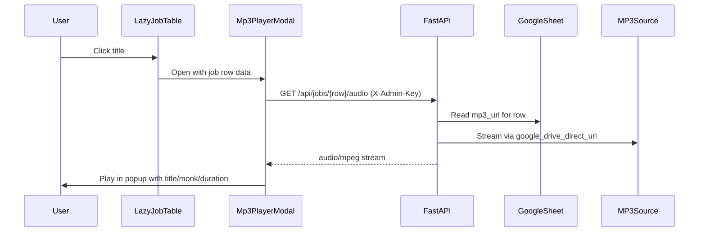

# Jobs Tab MP3 Player Popup

## Goal
Click a job **title** on the **Jobs tab only** → open a modal player showing **title**, **monk name**, and **duration**, playing audio from the row's Google Sheet `mp3_url`.

## Why a backend audio proxy is needed
Sheet `mp3_url` values are often **Google Drive links**. The bot already resolves these server-side in [`video_bot/media.py`](video_bot/media.py) (`google_drive_direct_url` + cookie confirm flow). Browsers cannot play those URLs directly in `<audio src="...">` (CORS/auth). The admin API also uses `X-Admin-Key`, which `<audio>` tags cannot send.

**Approach:** new authenticated endpoint streams the MP3; the frontend fetches with existing auth headers and uses a blob URL for playback.



## Backend changes

### 1. Expose `mp3_url` + sheet duration in job API
Update [`video_bot/api/job_listing.py`](video_bot/api/job_listing.py) `row_to_job_dict()`:

- Add `mp3_url` from `row.values.get("mp3_url", "").strip()`
- Add `duration` using existing [`get_duration_min()`](video_bot/jobs/row_helpers.py) (checks `duration_min`, `duration_minutes`, `duration`, `length_min`, `length`; returns `"-"` if missing)

```python
return {
    ...
    "mp3_url": row.values.get("mp3_url", "").strip(),
    "duration": get_duration_min(row),
}
```

No extra sheet reads — uses the same cached rows as `/api/jobs`.

### 2. Add audio stream endpoint
New route in [`video_bot/api/routes/jobs.py`](video_bot/api/routes/jobs.py):

`GET /api/jobs/{row_number}/audio`

- Look up row from `get_cached_sheet_rows()` by `row_number`
- Read `mp3_url`; return 404 if empty
- Reuse `google_drive_direct_url()` from [`video_bot/media.py`](video_bot/media.py) (extract shared stream helper if needed to avoid duplication)
- Stream bytes with `StreamingResponse`, `media_type="audio/mpeg"`
- Handle Drive `download_warning` cookie the same way as `download_file()`
- Protected by existing `verify_admin_api_key` router dependency

### 3. Tests
- Extend [`tests/`](tests/) (or add `tests/test_job_listing.py`) to assert `mp3_url` and `duration` appear in `row_to_job_dict()`
- Optional unit test for audio URL resolution helper (Drive URL → direct URL)

## Frontend changes

### 1. API client
Add to [`admin-panel/src/data/jobsApi.js`](admin-panel/src/data/jobsApi.js):

```js
export async function fetchJobAudioBlob(row) {
  const res = await fetch(`${API_BASE}/api/jobs/${row}/audio`, {
    headers: apiHeaders(),
  });
  if (!res.ok) throw new Error('Audio failed');
  return res.blob();
}
```

Re-export from [`admin-panel/src/data/api.js`](admin-panel/src/data/api.js).

### 2. New modal component
Create [`admin-panel/src/components/Mp3PlayerModal.jsx`](admin-panel/src/components/Mp3PlayerModal.jsx) following the pattern of [`JobLogModal.jsx`](admin-panel/src/components/JobLogModal.jsx):

- Props: `job`, `open`, `onClose`
- Header: **title** (large), **monk name** (subtitle)
- Duration line:
  - Show sheet `job.duration` when present and not `"-"`
  - On `loadedmetadata`, if sheet duration missing, show formatted MP3 duration (`mm:ss` or `h:mm:ss`)
- Body: native `<audio controls autoPlay>` (no new npm deps)
- On open: fetch blob → `URL.createObjectURL` → set as `src`
- On close/unmount: `URL.revokeObjectURL`, pause audio
- Loading + error states (“Loading audio…”, “No mp3_url for this row”, fetch failures)
- Escape key + overlay click to close (match existing modals)

### 3. Make title clickable on Jobs tab only
Update [`admin-panel/src/components/LazyJobTable.jsx`](admin-panel/src/components/LazyJobTable.jsx):

- Add prop `enableTitlePlayer={false}` (default)
- When `enableTitlePlayer && job.mp3_url`: render title as a button/link styled like accent text
- When no `mp3_url`: keep plain text (not clickable)
- Manage `playerJob` state + render `<Mp3PlayerModal>`

Update [`admin-panel/src/pages/Jobs.jsx`](admin-panel/src/pages/Jobs.jsx):

```jsx
<LazyJobTable ... enableTitlePlayer />
```

Dashboard [`Dashboard.jsx`](admin-panel/src/pages/Dashboard.jsx) unchanged — titles stay non-clickable.

### 4. Styles
Add minimal CSS in [`admin-panel/src/index.css`](admin-panel/src/index.css):

- `.job-title-btn` — clickable title (accent, hover underline)
- `.mp3-player-meta` — monk + duration layout
- `.mp3-player-audio` — full-width audio control in modal

## UX behavior summary

| Case | Behavior |
|------|----------|
| Jobs tab, row has `mp3_url` | Title is clickable → popup player |
| Jobs tab, no `mp3_url` | Title plain text |
| Dashboard | Title plain text (no player) |
| Duration | Sheet column first; if `"-"`, update from MP3 when loaded |
| Auth | Uses existing session `X-Admin-Key` via fetch blob |

## Deploy
1. Deploy Python changes + restart `videobot`
2. `npm run build` admin panel + upload `dist/` to VPS

## Out of scope (unless you want later)
- Waveform / seek thumbnails
- Playlist / queue
- Dashboard title clicks
- Caching audio blobs across page navigations
