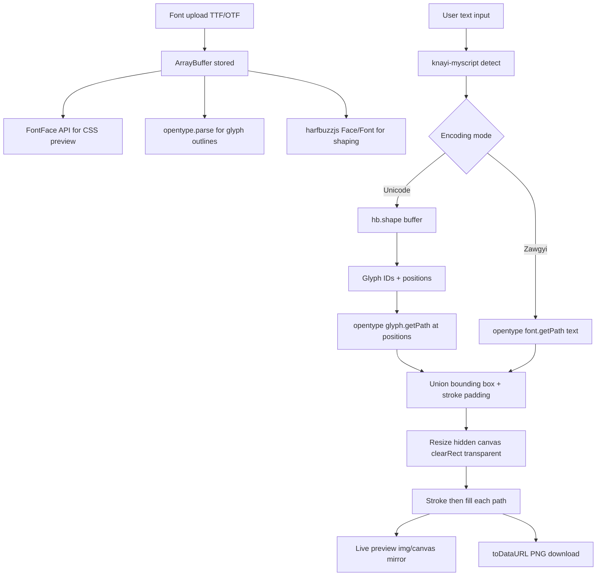

# Myanmar Font-to-PNG Export Tool

## Deliverable

One production-ready file at the user-chosen path **outside the repo**:

**Directory:** `C:\Users\Aung\OneDrive\Desktop\New folder (2)\`  
**File:** `C:\Users\Aung\OneDrive\Desktop\New folder (2)\index.html`

- No build step, no backend, no npm — open locally or host the folder on GitHub Pages / any static host.
- All CSS (Tailwind config + small custom rules) and JavaScript inline in that single file.
- Well-commented sections: `<!-- UI -->`, `/* Preview chrome */`, `// Font loading`, `// Shaping`, `// Canvas export`.

### Notes on this location

- This path is **outside** the `J:/cuaor+` git repo — the tool will not be tracked by this project's git unless you move or copy it later.
- OneDrive may sync the file automatically; fine for local use.
- For GitHub Pages, upload the folder contents or point a Pages branch at a copy of this folder.

---

## Architecture

Myanmar Unicode requires **OpenType shaping** (GSUB reordering of medials, asat, virama stacks). Raw Canvas `fillText()` and naive opentype.js `font.getPath(text)` both fail for complex syllables. The tool uses a **hybrid pipeline**:



| Layer | Library | Role |
|-------|---------|------|
| UI | Tailwind CDN | Dark layout, responsive grid, form controls |
| Encoding | knayi-myscript | Auto-detect Unicode vs Zawgyi; optional manual override |
| CSS preview | FontFace API | Instant WYSIWYG in a styled `<div>` (not used for export) |
| Shaping (Unicode) | harfbuzzjs (WASM) | Correct Myanmar syllable → glyph mapping |
| Path extraction | opentype.js | Bézier outlines per glyph; `Path.getBoundingBox()` |
| Export | Canvas 2D | Transparent PNG via `canvas.toDataURL('image/png')` |

**Zawgyi note:** Legacy Zawgyi fonts are encoded at the codepoint level (not shaped). For Zawgyi input, skip HarfBuzz and call `opentypeFont.getPath(text, x, y, fontSize)` directly.

---

## UI Layout (Tailwind dark mode)

Two-column responsive layout (`lg:grid-cols-2`), max-width container, slate/zinc palette:

**Left — Controls**
- Font upload: `<input type="file" accept=".ttf,.otf,font/ttf,font/otf">` + filename badge + loading/error state
- Textarea for Myanmar text (multi-line)
- Encoding selector: `Auto` (default) | `Unicode` | `Zawgyi` + live badge
- Font size slider: 20–200 px with live value label
- Fill color picker (default `#FFFFFF`)
- Stroke color picker (default `#000000`)
- Stroke width slider: 0–20 px (0 = no outline)
- **Download PNG** button (disabled until font loaded + non-empty text)

**Right — Preview**
- Checkered transparency background
- Canvas preview mirrored at 1:1 (scaled down with CSS `max-w-full` if large)
- Optional CSS `<div>` preview using FontFace

---

## CDN Dependencies (pinned versions)

- Tailwind CSS CDN
- opentype.js 1.3.4
- harfbuzzjs 0.10.3 (hbjs.js + hb.wasm)
- knayi-myscript 0.2.0

---

## Local testing

From the target folder:

```powershell
cd "C:\Users\Aung\OneDrive\Desktop\New folder (2)"
npx serve .
```

HarfBuzz WASM requires HTTP(S), not `file://`.

---

## Implementation todos

- [ ] Create `index.html` at `C:\Users\Aung\OneDrive\Desktop\New folder (2)\` with Tailwind dark UI shell
- [ ] Implement FontFace + opentype.parse + harfbuzzjs WASM init on font upload
- [ ] Integrate knayi-myscript auto-detect and encoding mode selector
- [ ] Build dual render path (HB+opentype for Unicode, direct getPath for Zawgyi)
- [ ] Wire debounced live preview, transparent canvas, and Download PNG button
- [ ] Test with Unicode and Zawgyi fonts locally via HTTP server
