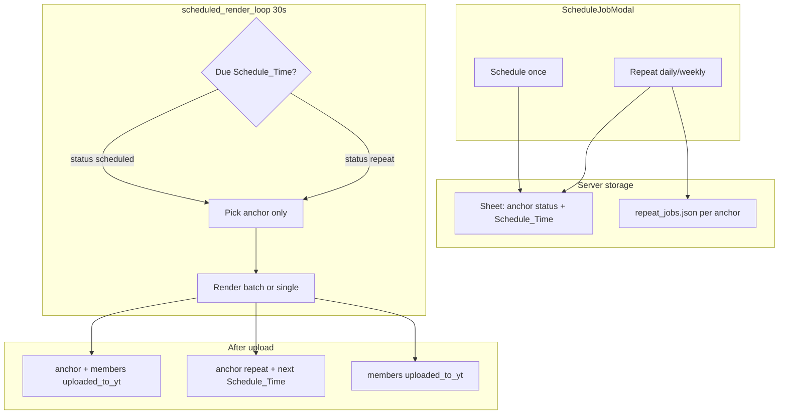

# Implement Repeat Status (anchor-only, no member sync)

## Decisions locked in

- **Dropped:** syncing `scheduled` / `repeat` to all batch member rows — **anchor only** holds schedule/repeat (same as today for `scheduled`).
- **Kept:** [Settings → Interval Triggers](admin-panel/src/components/IntervalTriggerSettings.jsx) for global **`do`** rows; document that **Repeat** = per-job from Jobs modal.
- **Batch:** schedule/repeat on any batch row → resolves to anchor via [`resolve_batch_anchor_row`](video_bot/row_rules.py); members stay `pending` (or `uploaded_to_yt` after run).

## Architecture



## 1. Backend: repeat config module

Add [`video_bot/repeat_jobs.py`](video_bot/repeat_jobs.py) (mirror patterns from [`video_bot/interval_triggers.py`](video_bot/interval_triggers.py)):

- Dataclass `RepeatJob`: `anchor_row`, `repeat_type` (`daily` | `weekly`), `time` (`HH:MM`), `days_of_week`, `timezone`
- Persist to `repeat_jobs.json` (new `REPEAT_JOBS_PATH` in [`video_bot/config.py`](video_bot/config.py))
- Helpers: `load/save/delete_repeat_job`, `compute_next_run(repeat_job, after: datetime) -> datetime`, `repeat_slot_key()` for conflict checks

**Why JSON + sheet:** `Schedule_Time` on anchor = next fire time (visible in Jobs table); repeat pattern lives in JSON (not new sheet columns).

## 2. Backend: schedule API split into once vs repeat

Extend [`ScheduleJobRequest`](video_bot/api/schemas.py):

```python
mode: Literal["once", "repeat"] = "once"
schedule_time: str  # required for once (full ISO)
repeat_type: Literal["daily", "weekly"] = "daily"
repeat_time: str = "07:00"  # HH:MM for repeat
days_of_week: list[int] = []  # weekly only
timezone: str = "UTC"
```

Update [`schedule_sheet_row`](video_bot/sheets.py) → split logic:

| Mode | Anchor status | Schedule_Time | repeat_jobs.json |
|------|---------------|---------------|------------------|
| `once` | `scheduled` | exact datetime | delete entry |
| `repeat` | `repeat` | **next** computed run | save config |

- Batch: still redirect to anchor; **do not** change member statuses ([`_clear_batch_member_schedules`](video_bot/sheets.py) stays — members → `pending` if they had stray `scheduled`).
- Replace [`find_schedule_time_conflict`](video_bot/sheets.py) with **`find_time_slot_conflict`**:
  - **Once:** exact datetime unique; also block if any **repeat** job uses same local `(timezone, HH:MM)` on that calendar day
  - **Repeat:** block if another repeat shares same `(timezone, HH:MM, overlapping weekdays)`; block if any **scheduled** row’s datetime converts to that repeat slot
  - Exclude **anchor row only** when editing same job (not whole batch — avoids false self-conflict without member sync)
  - Return clear error for modal: `"Row #15213 — repeat daily at 07:00 Asia/Yangon"`

## 3. Backend: scheduler picks due `repeat` rows

In [`video_bot/sheets.py`](video_bot/sheets.py):

- Extend `_collect_due_scheduled_anchors` → `_collect_due_timed_anchors` accepting statuses `scheduled` and `repeat`
- `has_due_scheduled_row` → include due `repeat` anchors
- [`reserve_next_pending_row`](video_bot/sheets.py): due timed rows first (unchanged priority); **`do`** path unchanged

In [`video_bot/sheets.py`](video_bot/sheets.py) `_resolve_do_anchor`: skip anchors with status **`repeat`** (same as `scheduled` today).

[`auto_trigger_do_for_row_rules`](video_bot/sheets.py): skip rows with status **`repeat`** (extend existing `scheduled` skip).

## 4. Backend: post-upload reschedule (repeat only)

In [`video_bot/jobs/pipeline.py`](video_bot/jobs/pipeline.py) success path (~line 213):

- If anchor has repeat config in JSON (or status was `repeat` before processing):
  - **Anchor:** `compute_next_run` → update `Schedule_Time` → status stays **`repeat`**
  - **Batch members:** still → `uploaded_to_yt` (batch audio uses row numbers, not member status)
- Else (one-time `scheduled`): current behavior — all rows → `uploaded_to_yt`

On **failed** render: anchor → `failed`; repeat config **kept**; `Schedule_Time` unchanged (user retries manually).

## 5. Backend: status constants and listing

- [`video_bot/job_status.py`](video_bot/job_status.py): add `"repeat"` to filter keys
- [`video_bot/api/job_listing.py`](video_bot/api/job_listing.py): count/filter `repeat`; optionally expose `repeat_mode` / `repeat_time` in job dict from JSON for modal prefill

## 6. Admin UI: Schedule modal

Update [`admin-panel/src/components/ScheduleJobModal.jsx`](admin-panel/src/components/ScheduleJobModal.jsx):

- Toggle: **Schedule once** | **Repeat**
- **Once:** existing `datetime-local` field
- **Repeat:** time input (`07:00`), pattern (Daily / Weekly + weekday chips), timezone select (reuse list from interval triggers or fixed set)
- Hint: batch jobs apply to **anchor row #N**
- Show API conflict errors inline

Update [`admin-panel/src/data/jobsApi.js`](admin-panel/src/data/jobsApi.js) `scheduleJob` payload.

## 7. Admin UI: status badge and filter

- [`admin-panel/src/data/statusTheme.js`](admin-panel/src/data/statusTheme.js): `repeat` badge (e.g. accent/gold)
- [`admin-panel/src/data/jobsSheet.js`](admin-panel/src/data/jobsSheet.js): add **Repeat** filter tab
- [`admin-panel/src/components/LazyJobTable.jsx`](admin-panel/src/components/LazyJobTable.jsx): show next run from `schedule_time` for repeat rows

## 8. Tests

Add [`tests/test_repeat_jobs.py`](tests/test_repeat_jobs.py):

- `compute_next_run` daily/weekly/timezone edge cases
- Conflict: repeat 07:00 vs schedule once at same local time
- Conflict: two repeat jobs same slot

Extend [`tests/test_sheet_queue.py`](tests/test_sheet_queue.py):

- Due `repeat` anchor picked
- `do` queue skips `repeat` anchor

Extend [`tests/test_schedule_batch.py`](tests/test_schedule_batch.py):

- Repeat on member redirects to anchor; members stay `pending`

Add pipeline test (mock): repeat anchor rescheduled after upload; members `uploaded_to_yt`.

## 9. Docs

Update [`VIDEO_AUTOMATION.md`](VIDEO_AUTOMATION.md):

- Status table: `scheduled` vs `repeat`
- Workflow examples (batch daily 07:00 Yangon, one-time schedule)
- Interval Triggers vs Repeat comparison
- Explicit note: **members not synced** — only anchor shows repeat/scheduled

## Out of scope (this PR)

- Batch member status sync (explicitly removed)
- Removing Interval Triggers
- Auto-clearing member `uploaded_to_yt` between repeat cycles (not required for render)

## Risk mitigations

| Risk | Mitigation |
|------|------------|
| Double render | Anchor-only queue + existing batch dedupe in `_collect_due_timed_anchors` |
| Repeat + interval both fire | Repeat uses `repeat` status; interval uses `do` only — mutually exclusive on anchor |
| Stale repeat JSON | Delete JSON when switching to once or clearing schedule |
| Missed 7:00 (bot down) | Same as scheduled: due if `Schedule_Time <= now` on next poll |
