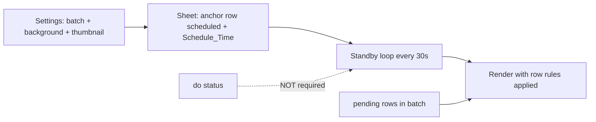

# Scheduled + Row Rules Workflow (No `do` Required)

## Your intended workflow



1. Configure **Row-Based Rules** (Select Rows, background, thumbnail) in Settings
2. In Google Sheet: set **anchor row** to `scheduled` and fill **`schedule_time`** column
3. Batch member rows can stay **`pending`**
4. Bot renders at due time using your background/thumbnail — **no need to set `do`**

Row rules already apply at render time via [`get_rule_for_row()`](video_bot/row_rules.py) and [`get_batch_rule_for_anchor()`](video_bot/jobs/pipeline.py) — no change needed there.

---

## Problem today

### 1. Batch member rows are silently skipped

In [`video_bot/sheets.py`](video_bot/sheets.py), `_row_eligible_for_queue()` returns `False` for batch **member** rows (non-anchor):

```148:151:video_bot/sheets.py
def _row_eligible_for_queue(row: SheetRow) -> bool:
    if is_batch_member_row(row.row_number):
        return False
    return True
```

If you set `scheduled` + `Schedule_Time` on row **601** in a batch `70, 601, 805`, the bot **never picks it** because only anchor **70** is eligible. This is the most likely reason scheduling “doesn’t work” without changing to `do`.

### 2. Workflow not obvious in UI

[`RowRulesTable.jsx`](admin-panel/src/components/RowRulesTable.jsx) mentions the anchor but doesn’t say:
- Only the **first row** in Select Rows should be `scheduled`
- Member rows should stay `pending`
- **`do` is not needed** when using schedule

---

## Backend fix — batch-aware scheduled queue

Update [`video_bot/sheets.py`](video_bot/sheets.py):

### New helper: `resolve_scheduled_candidate(row) -> SheetRow`

When collecting due scheduled rows in `reserve_next_pending_row()`:

1. If row is `scheduled` and due → resolve to **batch anchor** via existing [`resolve_batch_anchor_row()`](video_bot/row_rules.py)
2. Look up anchor `SheetRow` from the sheet rows list
3. Deduplicate by anchor (multiple members scheduled → one job)
4. Pick earliest due time per anchor

Also update [`has_due_scheduled_row()`](video_bot/sheets.py) to use the same anchor resolution so standby loop detects due jobs even when a member row is scheduled.

### Logging

When a member row’s schedule redirects to anchor, log once:
`Scheduled row 601 is batch member — using anchor row 70`

---

## UI + docs clarity

### [`admin-panel/src/components/RowRulesTable.jsx`](admin-panel/src/components/RowRulesTable.jsx)

Add a short hint under the batch rules header:

> **Schedule only the first row** in Select Rows (`scheduled` + Schedule_Time in the sheet). Other rows in the batch stay `pending`. Background/thumbnail from this rule apply automatically — you do **not** need `do` status.

### [`VIDEO_AUTOMATION.md`](VIDEO_AUTOMATION.md)

Add a **“Scheduling with batch rules”** subsection:

| Row | Status | Schedule_Time |
|-----|--------|---------------|
| Anchor (first in Select Rows) | `scheduled` | Your due datetime |
| Batch members | `pending` (or any non-processing) | empty |

Explicitly state: **`do` is optional manual priority only; not required when using schedule + row rules.**

---

## Tests

Extend [`tests/test_sheet_queue.py`](tests/test_sheet_queue.py):

- Due scheduled **member** row resolves to anchor and anchor is reserved
- `has_renderable_queue_row` true when only member is scheduled+due
- Anchor scheduled still works as today
- `do` rows still picked when no due scheduled

---

## Deploy

1. Deploy [`video_bot/sheets.py`](video_bot/sheets.py) (+ tests locally)
2. Optional: rebuild admin panel for RowRulesTable hint
3. `systemctl restart videobot`

---

## What you should do in the sheet (after fix)

Example batch rule: Select Rows = `13409, 13410, 13411`

| Row | status | schedule_time |
|-----|--------|---------------|
| **13409** (anchor) | `scheduled` | your due time |
| 13410 | `pending` | (empty) |
| 13411 | `pending` | (empty) |

Set background/thumbnail in Settings only. **Do not change to `do`.** Standby will pick row 13409 when time is due and apply your row rule media.
