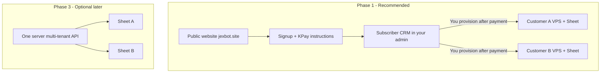
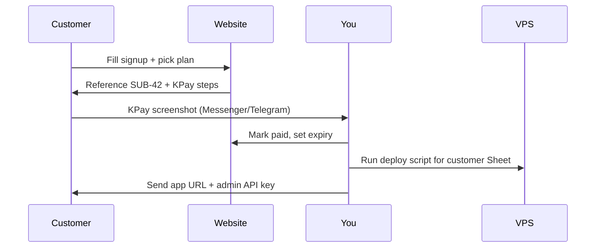

# Subscription selling plan (VideoBot SaaS, manual KPay)

## Current state

Your stack at [jexbot.site](https://jexbot.site) is **single-tenant**:

- One Google Sheet, one Telegram bot, one shared [`ADMIN_API_KEY`](video_bot/api_auth.py) checked by [`verify_admin_api_key`](video_bot/api_auth.py)
- React admin panel login stores that key in session ([`admin-panel/src/data/adminAuth.js`](admin-panel/src/data/adminAuth.js))
- **No** users, tenants, plans, or payment code exists (grep found zero Stripe/billing references)

Selling subscriptions to **other channel operators** means each customer needs **their own Sheet + bot + admin panel**. You chose **manual bank/KPay** collection first.

## Recommendation: tenancy model



| Approach | Fits manual KPay? | Effort | When |
|----------|-------------------|--------|------|
| **Separate VPS per customer** (recommended start) | Yes — pay → you deploy → send them URL + API key | Low | Now |
| **Multi-tenant on one server** | Possible but heavy | High | 10+ customers |
| **License key on shared instance** | Poor fit — everyone shares one Sheet | Not recommended | — |

**Why separate VPS first:** Your bot ([`video_bot/app.py`](video_bot/app.py)), sheet cache, render queue, and [`ADMIN_API_KEY`](video_bot/config.py) assume **one operator**. Reusing [`deploy/remote-deploy.ps1`](deploy/remote-deploy.ps1) per customer avoids rewriting the entire pipeline.

---

## Phase 1 — Public website + manual subscription flow (MVP)

**Goal:** Visitors see pricing, request a plan, pay via KPay, you activate them manually.

### 1.1 Marketing pages (admin panel or small landing app)

Add public routes (no auth) to the existing React app or a lightweight `/marketing` section:

| Page | Purpose |
|------|---------|
| `/pricing` | Plans (e.g. Basic / Pro), monthly fee in MMK, feature bullets |
| `/signup` | Form: name, org/channel, email, phone, chosen plan |
| `/signup/thanks` | KPay instructions: amount, account/phone, **reference code** (`SUB-{id}`), “payment within 24h” |

Reuse your design tokens from [`admin-panel/src/styles/tokens.css`](admin-panel/src/styles/tokens.css) so it matches the admin panel brand.

### 1.2 Backend: subscription requests (FastAPI)

New module e.g. [`video_bot/api/routes/billing.py`](video_bot/api/routes/billing.py) + SQLite (or JSON file initially) on the VPS:

```python
# subscribers table (minimal)
id, email, org_name, phone, plan_id, status, reference_code,
created_at, paid_at, expires_at, notes,
deploy_url, admin_key_hint  # filled when you provision
```

| Endpoint | Auth | Action |
|----------|------|--------|
| `POST /api/public/signup` | None (rate-limited) | Create row `status=pending_payment`, return reference + KPay instructions |
| `GET /api/health` | None | Already exists |

**Do not** expose full admin API keys on signup. Only return a reference code.

Config in [`.env.example`](.env.example):

- `KPAY_PHONE`, `KPAY_NAME`, `SUBSCRIPTION_PRICE_MMK`, `SUBSCRIPTION_CONTACT_EMAIL`

### 1.3 Super-admin: manage subscribers (your panel only)

Extend admin panel with a **Subscribers** section (visible only when logged in with **owner** key):

- List: pending / active / expired
- Actions: **Mark paid**, set `expires_at` (+30 days), add notes, record `deploy_url`
- Optional: “Send welcome email” template (copy-paste for now)

Protect new routes with a second env var:

- `OWNER_API_KEY` — full access including subscriber CRM + kill server
- Per-customer `ADMIN_API_KEY` — existing jobs/settings only (unchanged on their VPS)

Update [`video_bot/api/app.py`](video_bot/api/app.py) to mount `billing` routes: public signup unauthenticated; CRM routes `Depends(verify_owner_key)`.

### 1.4 Manual KPay workflow (day-to-day)



**Your checklist after payment:**

1. Confirm amount + reference in KPay app  
2. Mark subscriber **active** in CRM  
3. Clone deploy: new domain or subdomain (`customer1.jexbot.site`), their `.env` (Sheet ID, Telegram token, new `ADMIN_API_KEY`)  
4. Run [`deploy/remote-deploy.ps1`](deploy/remote-deploy.ps1)  
5. Send customer login URL + key + short onboarding doc  

---

## Phase 2 — Subscription enforcement (per customer VPS)

On **each customer’s** instance (small change, repeat per deploy):

- Store `SUBSCRIPTION_EXPIRES_AT` in `.env` or SQLite  
- Middleware in [`verify_admin_api_key`](video_bot/api_auth.py): if `now > expires_at`, return `402 Payment Required`  
- Admin panel: banner “Subscription expired — contact support” when API returns 402  
- You extend expiry in CRM + SSH to update their `.env` or run a small `POST /api/owner/extend` on their box  

This keeps billing logic simple while you still collect KPay manually.

---

## Phase 3 — Optional upgrades (when you have repeat customers)

| Upgrade | When | Notes |
|---------|------|-------|
| Email notifications (signup, welcome, expiry reminder) | 5+ customers | Resend/SMTP or Telegram bot to you |
| Automated KPay verification | If provider offers API/webhook | Rare for KPay; often still manual |
| **Stripe / Paddle** | International cards | Replace manual “mark paid”; webhooks activate tenant |
| **Multi-tenant single server** | 10+ customers, cost pressure | Major refactor: tenant_id on all sheet operations, per-tenant credentials in DB |
| Customer self-service billing portal | After Stripe | Customer updates card, cancels |

---

## Phase 4 — What to put on the pricing page (content)

Example single-plan start (adjust MMK to your market):

- **VideoBot Pro** — monthly fee  
  - Google Sheet job queue + admin panel  
  - Scheduled / repeat renders  
  - YouTube upload + thumbnail  
  - Telegram notifications  
  - Setup assistance included first month  

Add FAQ: payment method (KPay), activation time (24–48h), cancellation, data ownership (their Sheet).

---

## Files you will touch (Phase 1 MVP)

| Area | Files |
|------|--------|
| API | New `video_bot/api/routes/billing.py`, `video_bot/subscribers.py` (DB), extend [`video_bot/api/app.py`](video_bot/api/app.py) |
| Auth | Extend [`video_bot/api_auth.py`](video_bot/api_auth.py) with `verify_owner_key` |
| Admin UI | New `admin-panel/src/pages/Pricing.jsx`, `Signup.jsx`, `Subscribers.jsx` (owner-only); routes in [`admin-panel/src/App.jsx`](admin-panel/src/App.jsx) |
| Config | [`.env.example`](.env.example), [`deploy/.env.production.example`](deploy/.env.production.example) |
| Docs | [`README.md`](README.md) or `docs/SUBSCRIPTIONS.md` — your internal runbook |

---

## Security essentials

- Rate-limit `POST /api/public/signup` (IP + email)  
- Never commit KPay credentials; use env vars  
- Owner CRM only behind `OWNER_API_KEY`  
- Each customer VPS: unique `ADMIN_API_KEY`, their own Google OAuth `token.json`  
- HTTPS already handled by [`deploy/nginx/videobot.ssl.conf`](deploy/nginx/videobot.ssl.conf)

---

## Effort estimate

| Phase | Scope | Time |
|-------|--------|------|
| **1** | Pricing + signup + SQLite + owner CRM + docs | 3–5 days |
| **2** | Expiry enforcement per VPS | 1 day |
| **3** | Stripe / multi-tenant | 2–4 weeks (later) |

---

## Suggested first sprint (actionable)

1. Add `subscribers` SQLite + `POST /api/public/signup` + owner list/activate API  
2. Build `/pricing` and `/signup` pages with KPay instructions  
3. Build owner **Subscribers** page in admin panel  
4. Write internal runbook: “new paying customer” deploy checklist  
5. Dogfood: create a fake signup, mark paid, practice full provision on a test subdomain  

After Phase 1 is live, you can accept real KPay payments without building Stripe yet.
